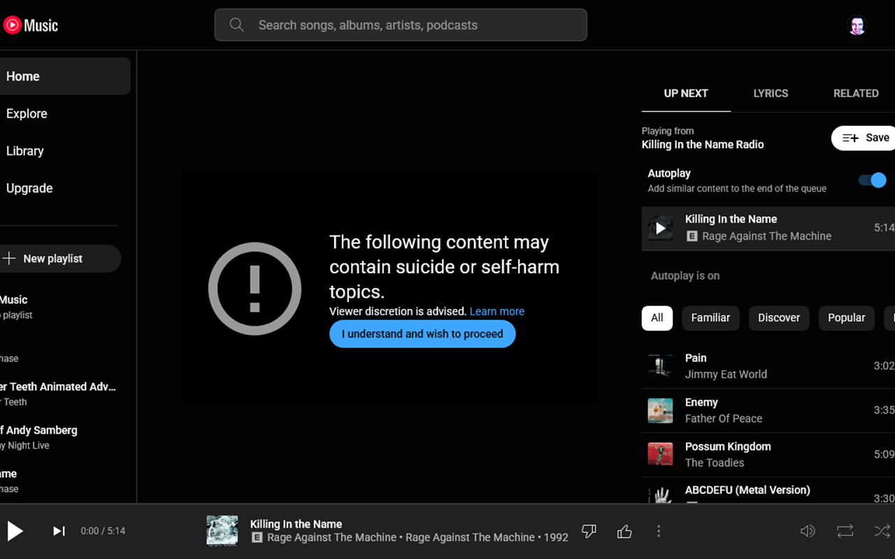

# F The Advisory

A Chrome and Firefox extension that will automatically handle the advisory warnings on YouTube Music, ensuring a smoother listening experience by skipping or dismissing warnings without user intervention.

## Features

- Automatically skips advisory content warnings on YouTube Music.
- Compatible with both Chrome and Firefox browsers.
- Lightweight and easy to use.

## Installation

1. Download the extension for your browser:
    - [Chrome Web Store]()
    - [Firefox Add-ons Store](https://addons.mozilla.org/en-US/firefox/addon/f-the-advisory/)
2. Install the extension and enable it in your browser settings.
3. Enjoy uninterrupted playback on YouTube Music.

## Usage

- The extension runs in the background and automatically detects advisory warnings on YouTube Music.
- No configuration is required – just install and let it work seamlessly.

## Development

### Prerequisites

- Node.js and pnpm installed on your system.

### Steps

1. Clone this repository:
   ```bash
   git clone https://github.com/your-username/the-advisory.git
   cd the-advisory
   ```
2. Install dependencies:
   ```bash
   pnpm install
   ```
3. Build the extension:
   ```bash
   pnpm build
   ```
4. Load the extension into your browser:
    - **Chrome**: Enable "Developer mode" in Extensions and load the packed folder.
    - **Firefox**: Load the `.xpi` file from the build output.

## Screenshots



## License

This project is licensed under the [MIT License](LICENSE).

## Contributing

Contributions are welcome! Feel free to open issues or submit pull requests to improve this project.